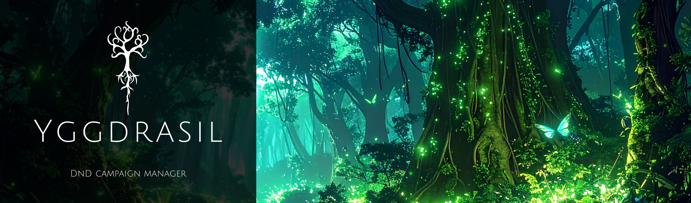

- - - -

# About Yggdrasil

Yggdrasil is an all-in-one platform built for Dungeon Masters and Dungeons & Dragons players. Designed to streamline the campaign experience. It makes running and managing D&D adventures effortless for both newcomers and seasoned veterans.

The platform features a fully integrated, game-style inventory and creation system — empowering you to design your own classes, spells, weapons, items, monsters, characters, and more.

I created Yggdrasil out of a desire to simplify the D&D experience. Unlike existing tools such as D&D Beyond, which often hide key features behind paywalls and clutter the campaign management process, Yggdrasil focuses on accessibility, flexibility, and intuitive design — so you can spend less time organizing and more time adventuring.

## How to run Yggdrasil

#### Step 1:

Clone the repo:
```
https://github.com/andrevanheerden/Yggdrasil.git
```
#### Step 2:

open yggdrasil frontend file in terminal:

```
cd frontend
```

#### Step 3:

Install dependencies using terminal:

```
npm install
```

#### Step 4:

now open a new terminal and open bakend files:

```
cd backend
```

#### Step 5:

start the backend: 

```
npm start
```

#### Step 6:

go backe to previos terminal and start the frontend: 

```
npm start
```

## Yggdrasil is build with


## How Yggdrasil was build

#### Frontend: React.js
React is a modern JavaScript library designed for building dynamic, responsive, and efficient user interfaces. It’s ideal for creating interactive elements such as character builders, dashboards, and live campaign previews, ensuring a seamless experience for both Dungeon Masters and players.

#### Backend: Node.js with Express
Node.js provides a fast and scalable server-side runtime for JavaScript, while Express simplifies routing, API development, and backend logic. Together, they deliver an efficient, modular system that integrates smoothly with React and supports real-time gameplay features.

#### Database: MySQL
MySQL is a reliable relational database system, perfect for managing structured D&D data such as characters, stats, spells, and inventories. It supports complex queries, ensures data integrity, and maintains robust relationships between tables — making it ideal for a world as detailed as Dungeons & Dragons.

## What problems does Yggdrasil solve
Most existing Dungeons & Dragons platforms restrict user creativity through paywalls and limited customisation options. These barriers prevent players and Dungeon Masters from fully expressing their imagination and managing their campaigns with freedom.

Yggdrasil addresses this issue by offering a completely open and accessible platform .All core features are free, with no hidden costs or restrictions. Users gain full creative control over their campaigns, from designing characters and encounters to crafting unique worlds, classes, spells, and items.

By removing limitations and empowering users to build without boundaries, Yggdrasil delivers a richer, more personalized D&D experience that goes beyond traditional platforms.

## How was Yggdrasil deployed 
#### Frontend:
The frontend is built with React.js and deployed on Vercel with a .xyz domain. It is connected to the backend via an environmental variable containing the backend URL, which was configured during the backend setup process.

#### Backend:
The backend is deployed on Render and linked to the frontend using the URL provided during deployment. This URL is stored as an environment variable in the frontend to ensure secure and seamless communication between the two layers.

#### Database:
The MySQL database is hosted on AlwaysData, which functions similarly to XAMPP. The only significant change required was updating the local configuration to use the AlwaysData connection details instead of the local setup. The database is also connected to the backend through environment variables for secure access.

## Challenges
During the creation of Yggdrasil, I encountered several challenges that helped me grow as a developer. One of the main challenges was time management. Balancing multiple major projects made it difficult to focus fully on the website, resulting in periods of intense “crunch time” to meet deadlines and collect metrics for evaluation. This experience taught me the importance of planning, prioritization, and maintaining a realistic development schedule.

Another significant challenge was the transition from MongoDB to MySQL, which required self-hosting and reconfiguring the database. I initially faced difficulties with XAMPP and setting up connections, but through persistence and research, I was able to overcome these issues and implement a stable solution. 

Finally, deploying the website presented its own hurdles. Many large deployment platforms, such as Azure, are feature-rich but not always intuitive, which made initial deployment complex. Navigating these platforms and finding a straightforward deployment path taught me valuable lessons about environmental variables, linking frontends and backends, and the importance of choosing deployment solutions that balance functionality with usability.

Overall, these challenges strengthened my problem-solving skills, improved my technical knowledge, and reinforced the value of planning and persistence in solo development projects.
## Mockups

<table>
  <tr>
    <td></td>
    <td></td>
  </tr>
  <tr>
    <td></td>
    <td></td>
  </tr>
</table>

## Conclusion
Developing Yggdrasil has been a valuable learning experience, allowing me to grow as a full-stack developer while creating a platform that empowers Dungeons & Dragons players to manage campaigns and unleash their creativity. I sincerely thank Tsungai Katsuro for their guidance and support, which made this project possible. For more information, please refer to the Documentation folder, which contains PDFs on my product proposal, design process, and SEO & Google Analytics documentation.

[](https://andredv.xyz/)

## Demo Video

[](https://drive.google.com/drive/u/0/folders/1HLpoQxmLsw_EykI3wrv6EeejwaA22XCM)

## Creaters

<a href="https://github.com/andrevanheerden/Yggdrasil/graphs/contributors">
  
</a>

## Acknowledgments

Thanks for these awesome help in teaching me the skills to develop this project 

- Tsungai Katsuro - tsungai@openwindow.co.za
